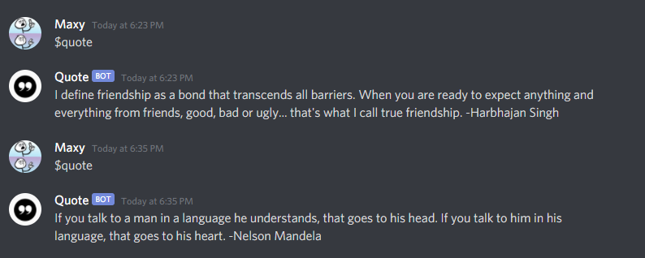

# QuoteBot
A python script for a discord bot which quotes quotes

## Usage 
After running the script the bot should respond to the messages sent in the chat

### In use

###### P.S. Use command $yo mama

## Live status
I haven't set up a server running with the script, if you want this bot to work on your server, a python script needs to be kept running on your discord server you will need to host it on [repl.it](https://repl.it/) and keep pinging it, here's an easy [tutorial](https://www.freecodecamp.org/news/create-a-discord-bot-with-python/) you can follow to do the same
